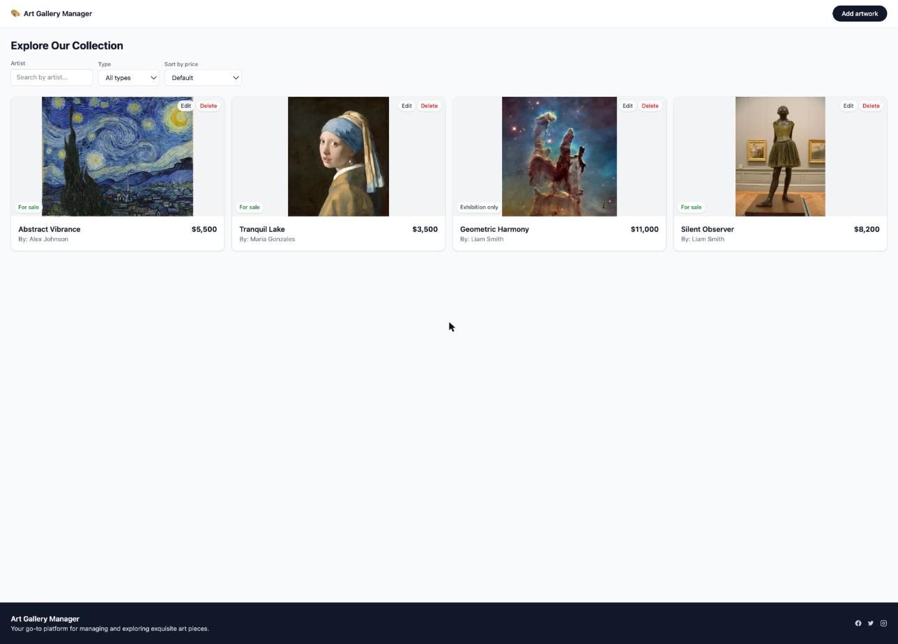

# Art Gallery Management System

A small virtual gallery manager: browse, filter, sort, create, edit and delete artworks. Built for the Techstack Trainee Full-Stack JS test task — both the frontend (React SPA) and backend (NestJS API) are implemented, with the backend as the frontend's real data source (no LocalStorage fallback).

**Live:** Frontend — _pending deploy_ · Backend — _pending deploy_ · Swagger — _pending deploy_

> Live links go up once deploy is done — see [How to run locally](#how-to-run-locally) in the meantime; `npm install && npm run dev` in each folder is the whole setup.



## What's implemented

### Backend (NestJS + Prisma + SQLite)

| Requirement | Status |
|---|---|
| `GET /artworks` — list, sort by price, filter by artist/type | ✅ |
| `GET /artworks/:id` | ✅ |
| `POST /artworks` with validation → 400 on invalid input | ✅ |
| `DELETE /artworks/:id` | ✅ |
| `PUT /artworks/:id` — listed as optional in the brief | ✅ implemented, not skipped |
| Seed: 4 artworks on first run | ✅ |
| Unified error shape, Swagger docs, CI, deploy config | ✅ |

### Frontend (React 19 + Vite + TanStack Query)

| Requirement | Status |
|---|---|
| List view (title, artist, type, price, availability) | ✅ |
| Sort by price (asc/desc) | ✅ |
| Filter by artist + type | ✅ |
| Add form: title/artist required, type from predefined list, price > 0, availability boolean | ✅ |
| Delete button per card | ✅ |
| Persistence across reload (via the real API, not LocalStorage) | ✅ |
| Edit — not required by the brief | ✅ implemented anyway, same form as create |

## How to run locally

```bash
git clone <this-repo> && cd art-gallery-management

# backend — http://localhost:3000
cd backend
npm install
cp .env.example .env
npm run start:dev

# frontend — http://localhost:5173 (separate terminal)
cd frontend
npm install
cp .env.example .env
npm run dev
```

No database setup needed — `backend/prisma/dev.db` is committed with the 4 seed artworks, so `npm install && npm run start:dev` is the entire backend setup. Swagger UI: `http://localhost:3000/api/docs`.

Per-package details (scripts, stack rationale, test breakdown): [`backend/README.md`](backend/README.md), [`frontend/README.md`](frontend/README.md).

## Stack and why

| Layer | Choice | Why |
|---|---|---|
| Backend framework | **NestJS 11** (not Express) | First-listed option in the brief; the author has direct production experience with it (Heartland Homes — 26 endpoints, ServiceDesk Pro), making it the faster, not slower, choice; built-in DI/Pipes/Filters/Swagger give a documented, validated API without hand-rolled middleware. Deliberately not NestJS 12 — its latest `@nestjs/config` line ships ESM-only, which breaks the standard Jest + ts-jest setup. |
| Database | **SQLite** (not Postgres) | The reviewer needs to run this with `npm i && npm run dev` — Postgres would mean Docker or a cloud instance just to review a CRUD test task. SQLite is a committed file: zero external dependencies. |
| ORM | **Prisma** (not TypeORM/Mongoose/Sequelize) | ORM is marked optional in the brief, so the suggested list is guidance, not a constraint. The author has direct recent experience with Prisma (Heartland, ServiceDesk, AdTell) and none with TypeORM — learning a new ORM against this deadline would risk exactly the kind of rework this project was planned to avoid. |
| Frontend framework | **React 19 + Vite + TypeScript strict** | The author's strongest stack (AdTell, Heartland Homes). |
| Data layer | **TanStack Query** | The 4 required UI states (loading/error/empty/success) come from `isPending`/`isError`/`data` directly; also gives cache invalidation and optimistic updates for delete for free. |
| Forms | **React Hook Form + Zod** | One form component in two modes (create/edit); the Zod schema mirrors the backend DTO's rules exactly. |
| Styling | **Tailwind CSS v4** | Zero-config via the Vite plugin. |

## Decisions on ambiguities in the brief

The task description leaves several things unspecified. Each was resolved deliberately — not by accident — and is listed here because this is usually the part a reviewer actually wants to see.

| # | Gap in the brief | Decision |
|---|---|---|
| 1 | The `Artwork` model has no image field, but the UI mockup shows pictures | The model wasn't extended — the brief's data contract is authoritative. Each card shows a representative, public-domain image for its `type` (not a fabricated picture of that specific piece), shown in full with `object-contain` — cropping an actual artwork's composition felt wrong for a gallery app, even for a placeholder. Painting and digital have two candidate images each (an artwork's id picks deterministically between them via a hash, so two artworks of the same type don't show an identical picture); sculpture and photography have one; print has none after a curation pass and falls back to a CSS gradient + initials — the same fallback used if an image fails to load, or for a future type with no image at all. Images in use: Van Gogh's *The Starry Night* and Vermeer's *Girl with a Pearl Earring* (painting), Degas' *Little Dancer of Fourteen Years* (sculpture), Dorothea Lange's *Migrant Mother* (photography), NASA/ESA's *Pillars of Creation* and the *Whirlpool Galaxy* (digital) — all public domain, via Wikimedia Commons; the sculpture image was deliberately picked clothed rather than a classic nude bronze (e.g. *David*), since a job-application screenshot is the wrong place for that call to be made by default. The first hash function tried (`(hash * 31 + charCode) % 997`) collided on this app's own seed data — two ids from the same `createMany()` batch share a long common prefix and differ by one digit, which was enough to land both in the same bucket — caught by eye in a screenshot, not by the test that was supposedly covering it; replaced with FNV-1a and locked in with a regression test (see `frontend/src/lib/artwork-placeholder.test.ts`). |
| 2 | `id: string`, but the example URL is `/artworks/3` | `id` is a string (`cuid`); the numeric example in the brief is illustrative, not a format requirement. |
| 3 | "First 4 artworks on start" — seed or pagination? | Read as a one-time seed: 4 artworks committed via `prisma/seed.ts`, not pagination. |
| 4 | `artist` max length (50) is only stated in the backend requirements, not the frontend's | Applied on both sides — one Zod schema on the frontend mirrors the backend DTO. |
| 5 | "Predefined types" — no list given | Defined one: `painting`, `sculpture`, `photography`, `digital`, `print`, shared as one constant on both frontend and backend. The backend returns 400 on an unknown type. |
| 6 | `availability` is required on the frontend form but optional on the backend | Backend: optional, defaults to `true`. Frontend: the checkbox always sends an explicit boolean. |
| 7 | `price: number` is money | Modeled as Prisma `Decimal`, not `Float`, to avoid floating-point rounding on currency. Decimal serializes to JSON as a string by default — the service layer explicitly calls `.toNumber()` so the frontend always receives a real number, not `"4500"`. |
| 8 | Sort query format | Implemented exactly as the brief shows it — `?price=asc`, not `?sort=price&order=asc`. |
| 9 | Artist filter — exact match or partial? | Case-insensitive, partial match. Neither Prisma's `mode: 'insensitive'` nor SQLite's own `LIKE`/`LOWER()` case-fold beyond ASCII, so the filter is applied in JS (`String.prototype.toLowerCase()`, which is Unicode-aware) after the query, not pushed into SQL — verified with a real non-ASCII name (`"Émile Zola"`), not just an uppercase/lowercase ASCII check. |
| 10 | Error codes aren't specified | 400 for validation, 404 for a missing id on GET/PUT/DELETE, 500 for anything else — all through one global exception filter with a single response shape (see [API contract](#api-contract)). |
| 11 | Nothing about CORS/security | `helmet`, a CORS allowlist, and env validation at startup. Rate limiting listed under "What I'd add next" rather than added speculatively. |
| 12 | Nothing about pagination | Not implemented — at 4–50 records it would add complexity without value; noted below instead of built speculatively. |
| 13 | "Gallery admins" mentioned nowhere else, no auth requirement | Not implemented — out of scope for the brief. Noted below with where a guard would go if it were needed. |

## API contract

```http
GET    /artworks?price=asc&artist=Picasso&type=painting   → 200 Artwork[]
GET    /artworks/:id                                       → 200 Artwork | 404
POST   /artworks                                           → 201 Artwork | 400
PUT    /artworks/:id                                       → 200 Artwork | 400 | 404
DELETE /artworks/:id                                       → 204 | 404
```

Interactive docs: `/api/docs` (Swagger). Full request/response examples: [`backend/requests.http`](backend/requests.http).

**Validation:** `title` required, ≤99 chars · `artist` required, ≤50 chars · `type` one of the predefined list · `price` required, > 0 · `availability` optional, defaults to `true`.

**Error shape** — every error, from every source:

```json
{
  "error": {
    "code": "VALIDATION_ERROR",
    "message": "Request validation failed",
    "details": [{ "field": "price", "message": "Price must be greater than 0" }]
  }
}
```

## Tests

- **Backend — 32 tests**: 24 e2e (`backend/test/artworks.e2e-spec.ts`, every case in the API contract above — sort/filter behavior, every validation edge case including whitespace-only input and non-ASCII artist names, 404s, the Decimal→number mapping) + 8 unit (`backend/src/artworks/artworks.service.spec.ts`).
- **Frontend — 16 tests** (Vitest + Testing Library): form validation and the edit flow, filters, all 4 list states, the delete confirm dialog, the artwork image hash. See [`frontend/README.md`](frontend/README.md#tests) for the breakdown.
- **CI**: `.github/workflows/ci.yml` runs typecheck, lint, build and the full test suite for both packages on every push and PR.

## What I'd add next

- **Authentication / roles** for "gallery admins" — out of scope for the brief; `backend/src/common/` is where a `JwtAuthGuard` would live if this became a real product.
- **Pagination** — not worth the complexity at the current record counts; would reconsider past a few hundred artworks.
- **Rate limiting** (`@nestjs/throttler`) — cheap to add, skipped to stay inside scope.
- **Image upload** — the brief's `Artwork` model has no image field, so this wasn't added; the frontend placeholder is a deliberate substitute, not a gap.
- **Playwright e2e** on the frontend — RTL component tests were judged sufficient for this scope; e2e would close the gap between "components behave correctly in isolation" and "the real user flow works end-to-end."
- **A genuine narrow-viewport screenshot check** — the responsive CSS was verified by code review against Tailwind's breakpoints rather than an actual mobile-width screenshot, because of a tooling limitation hit mid-task (browser automation's window resize didn't change the real viewport in this environment, and installing a second browser for testing had no network access). Noted here rather than silently assumed to be fine.
- **Abort in-flight requests on cancellation** — `useArtworksQuery` doesn't forward TanStack Query's `signal` to `fetch`, so when a mutation calls `cancelQueries`, the client discards the response but the request itself keeps running on the wire. Not a correctness issue (no stale data reaches the cache), just wasted load on rapid filter changes.
- **`placeholderData`/`keepPreviousData` on the list query** — every filter change briefly shows the full skeleton grid instead of keeping the previous results visible while the new filter loads; a one-line TanStack Query option away.
- **A persistent disk for the deployed database** — Render's free web-service plan has an ephemeral filesystem, so a `POST`/`PUT`/`DELETE` made against the live backend reverts to the 4 seed rows on the next restart, deploy, or idle spin-down. Fine for reviewing the API's behavior; a real deployment would mount a persistent disk (or move off SQLite) to keep writes.

## AI usage

This project was built with an AI coding assistant as a pair-programming tool, under direction and review at every step — not generated unattended and submitted as-is. The overall architecture, the decisions in the table above, and the scope (both parts, PUT included, tests, CI) were deliberate choices, not AI defaults. In practice that meant: writing code in small reviewed increments (one branch per feature), running the actual test suites and a real browser against the running app after every change rather than trusting that code compiles, and treating a failing check as something to fix immediately rather than carry forward. Several real bugs were caught this way during the build — a locale-dependent price format, a Decimal-to-string serialization issue, a silently no-op typecheck in a pre-push hook, an artist filter that only looked Unicode-safe because of an SQLite accident, whitespace-only input passing a "required" check, a modal dialog missing a real focus trap, a placeholder-image hash collision that a passing test suite missed but a screenshot caught immediately — documented inline in the relevant commits rather than smoothed over. AI accelerated the mechanical parts of implementation; the decisions, the verification, and the final responsibility for correctness are the author's.
